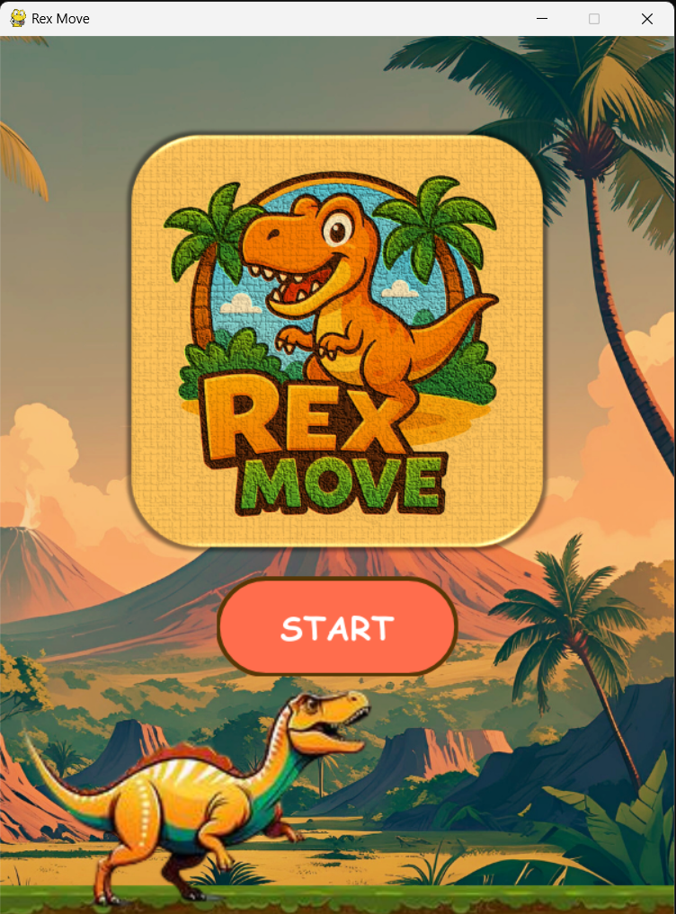

>[!IMPORTANT]
>  # $\color{orange}{Rex-Move}$
>

Rex-Move is a simple 2D game built in **Python** using **Pygame**.  
You control a character that moves left and right with the **A** and **D** keys to dodge falling meteors.  
The goal is to survive as long as possible without getting hit.

## Gameplay

- Move left with **A**
- Move right with **D**
- Avoid falling meteors
- Survive for a high score

## Features

- Lightweight and easy to run
- Simple controls
- Classic dodge survival gameplay
- Built with Pygame for learning and fun

## Requirements

Before running, make sure you have:

- Python (3.6 or newer recommended)
- Pygame library

## Installation

1. Clone the repository - <i>git clone https://github.com/NobodydeBunny/Rex-Move.git</i>
2. Change to project folder  
3. Install dependencies

## Running the Game

In the project directory, run:
<i>python start.py</i>

## Screenshots

| Home page | Gameplay | Game Over |
|---------|---------------|-----------|
|  |  |  |

## Controls

- **A** : move left  
- **D** : move right  

## How to Play

Avoid as many meteors as you can. The longer you survive, the highrt the score you get.

## Contribution

Feel free to:

- Add new features
- Improve graphics
- Adjust difficulty or gameplay
- Report bugs

## License

This project is open source and free to use.

